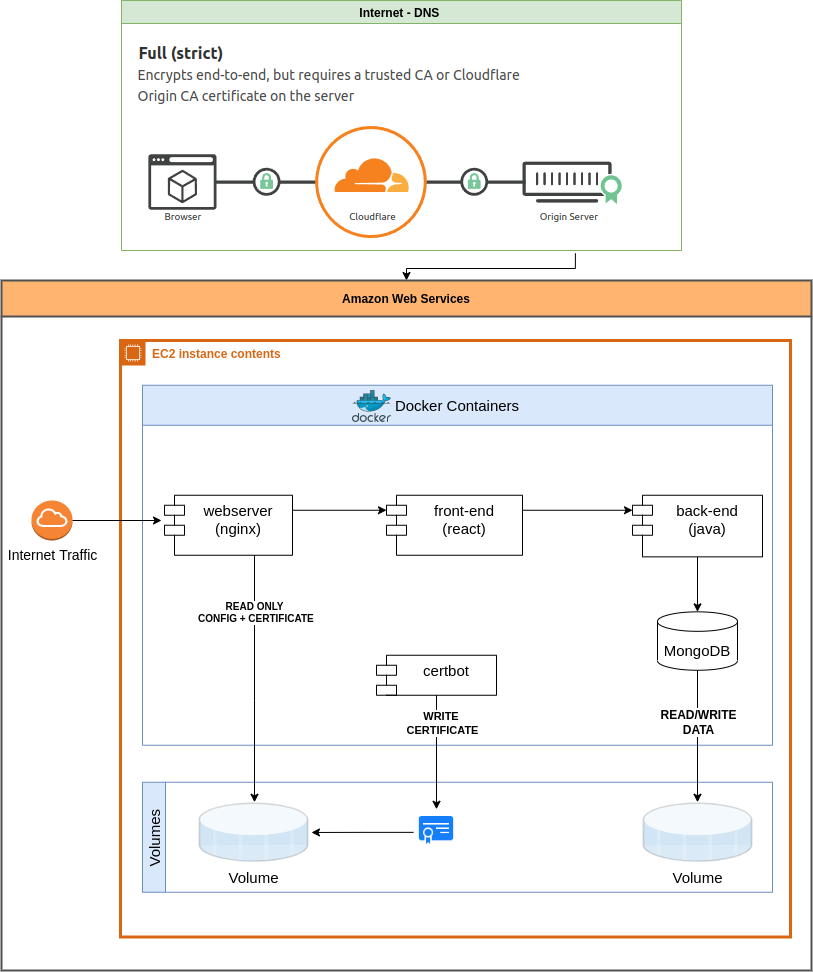

# Organize Matches

## Overview

A basic tool to create, edit and apply to football matches https://partidos.com.ar/. We use [vegeta load testing tool](https://github.com/tsenart/vegeta), docker, NoSQL database, React, and Java with Springboot. The API is documented using OpenApi 3.0, the deployment uses AWS EC2 instance + Cloudflare DNS and there is also a [TelegramBot](https://t.me/match_organizer_bot) client.

## Contents

- [Setup](#setup)
- [Basic Commands: Development](#basic-commands-development)
  - [Development URLs](#development-urls)
- [Basic Commands: Production](#basic-commands-production)
- [Load Testing](#load-testing)
- [Documentation](#documentation)
  - [Architecture Diagram](#architecture-diagram)
  - [MongoDB](#mongodb)


---

<a name="setup"/>

## Setup

1. Install Docker + Docker Compose: https://www.docker.com/

2. In the root of the project `/organize-matches`, create a `.env` file with the following content:

```
DOCKER_REGISTRY=tacs2022
# Opcional
# TELEGRAM_BOT_TOKEN=<TOKEN-para-activar-Telegram-Text-Commands>
```

3. Optional: Login to the Docker registry (required for Docker image pushes)

```
$ docker login -u tacs2022 -p <registry-password>
```
4. For the database creation to work, a file named `mongo-pass.txt` with the password of the `root` user of the database (e.g. Pass1234!@) should be created in the root of the project `/organize-matches`.

---

<a name="commandsdev"/>

## Basic Commands: Development

Build docker image - MacOS/Linux:
```
$ make build # Create docker image of all components (backend+frontend)
```

Run app locally - MacOS/Linux:
```
# Starts all containers locally.
# Needs to run 'make build' beforehand to pick up the latest changes
make dev
```

Stop app locally - MacOS/Linux:
```
make stop # Terminates the execution of all containers
```

To push an image with the version to be deployed to Dockerhub:
```shell
make push-images
```

<a name="urlsdev"/>

### Development URLs

- Front End http://localhost:3001
- Back End API Documentation http://localhost:8081/swagger-ui/index.html
- UI Mongo-Express http://localhost:8082/

---

<a name="commandsprod"/>

## Basic Commands: Production

Inside EC2 instance:


1. Download latest tagged image from Docker registry
```
make pull-images
```

2. Run docker project with volume - MacOS/Linux:
```
# Stop/Clean up old containers
make stop
```

2. Run docker project with volume - MacOS/Linux:
```
# Start containers with a dedicated volume for the Mongo container.
make prod
```

---

<a name="loadtesting"/>

## Load Testing

To see the available HTTP load tests, execute the following command:

```shell
make help | grep lt
```

To modify load testing parameters, modify the following variables in the Makefile:

```
VEGETA_DURATION = 10s # Test duration in seconds
VEGETA_RATE = 0 # Maximum request rate per second. (0 is infinite)
VEGETA_MAX_WORKERS = 1000 # Maximum number of users (Note: 1 user can make N requests)
```


<a name="doc"/>

## Documentation

<a name="doc-arq"/>

### Architecture Diagram




<a name="doc-mongo"/>

### MongoDB

We decided to use the MongoDB NoSQL database because we believe that the functionality may vary in the future, and this database is more flexible for adding new functionality than, for example, Cassandra.
